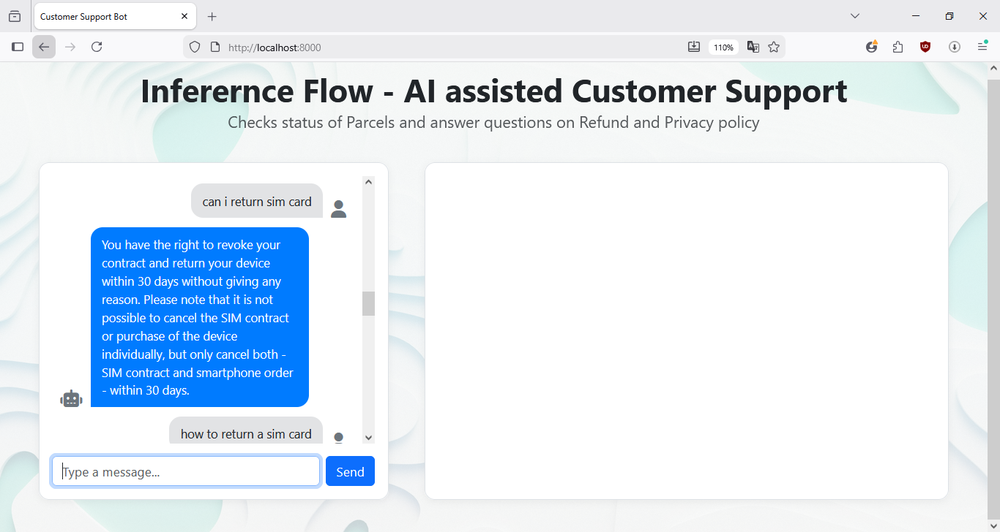
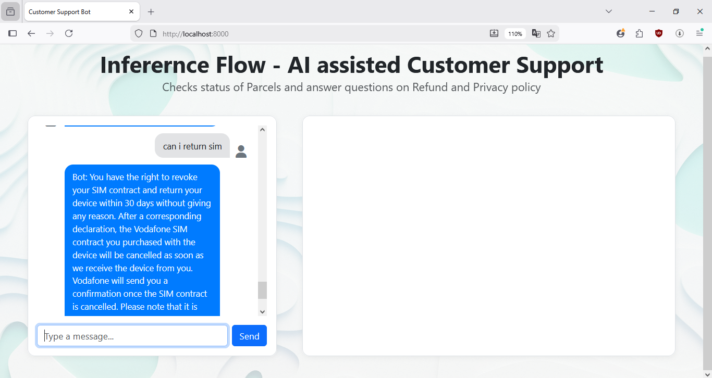
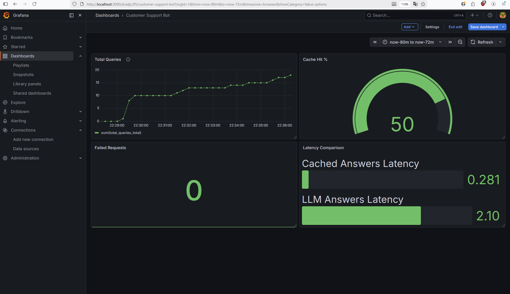

## 🟢 Introduction

InferenceFlow is a production-style LLM-powered customer support system that handles parcel tracking and policy-related queries (refund & privacy). It combines FAISS-based retrieval with semantic caching to deliver fast, consistent responses. The system is fully instrumented with Prometheus and Grafana to monitor latency, cache efficiency, and token usage.

---

---

## 🟢 Features & Demo

### 📦 Track Package Status

Track parcel status using tracking ID with real-time lookup from the internal database.

---

### 💰 Refund Policy Queries

Answer customer queries related to refund policies using retrieved contextual knowledge.

---

### 🔒 Privacy Policy Queries

Handles questions about privacy policies with grounded responses from embedded data.

---

### ⚡ Semantic Caching (Step 1)

User asks a question about SIM card refund — system performs full LLM call.

---

### ⚡ Semantic Caching (Step 2)

User asks a similar question — cached response is returned instantly without invoking the LLM.

---

### 📊 Token Usage Monitoring

Grafana dashboard tracking total input and output token usage.

---

### 🚨 Prometheus Alert

Prometheus alert triggered when token usage crosses a defined threshold (e.g., 5000 tokens).

---

### 📈 Grafana Dashboard Insights

Dashboard showing system performance:
- ~50% queries served via semantic cache  
- Cached query latency: ~0.28s  
- LLM query latency: ~2.10s  

---


## 🟢 Setup (Docker)

```bash
# Clone repo
git clone <your-repo>
cd <your-repo>

# Start all services
docker compose up --build
```

This will start:
- Flask app → http://localhost:8000  
- Prometheus → http://localhost:9090  
- Grafana → http://localhost:3000  

---

## 🟢 Using Prometheus

1. Open:
```
http://localhost:9090
```

2. Go to **Graph** tab

3. Run queries like:
```promql
total_queries
rate(llm_calls_total[1m])
rate(cache_hits_total[1m])
```

This shows live system metrics such as:
- total queries  
- cache hits vs LLM calls  
- latency trends  

---

## 🟢 Viewing Grafana Dashboards

1. Open:
```
http://localhost:3000
```

2. Login:
```
user: admin
password: admin
```

3. Add Prometheus datasource:
```
URL: http://prometheus:9090
```

4. Create dashboards using queries like:

**Cache Hit %**
```promql
100 * sum(rate(cache_hits_total[1m])) /
(sum(rate(cache_hits_total[1m])) + sum(rate(llm_calls_total[1m])))
```

**LLM Latency**
```promql
rate(llm_latency_seconds_sum[1m]) /
rate(llm_latency_seconds_count[1m])
```

**Total Queries**
```promql
rate(total_queries[1m])
```

---

## 🟢 What to Expect

- Semantic caching reduces response latency significantly (~10x for repeated queries)  
- Dashboards visualize system performance in real time  
- Alerts can be configured for failures or latency spikes  